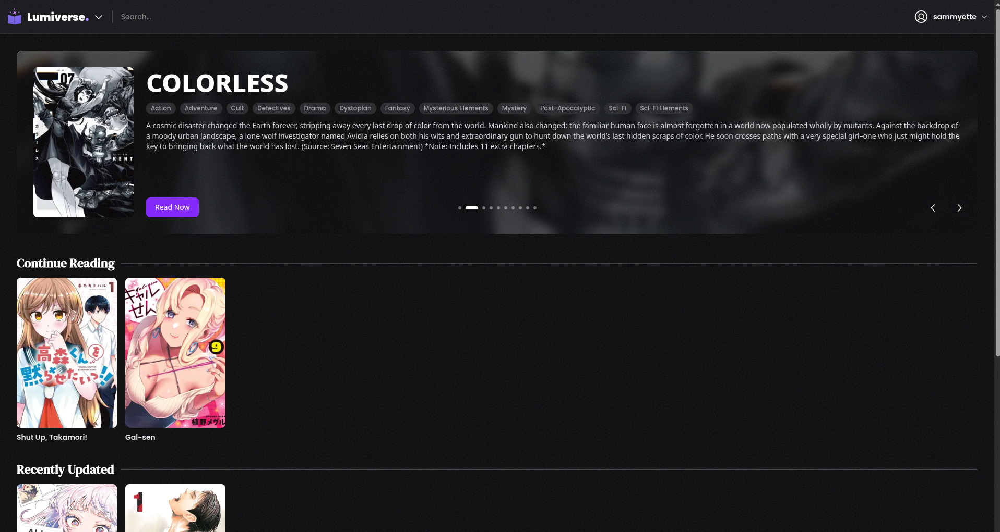
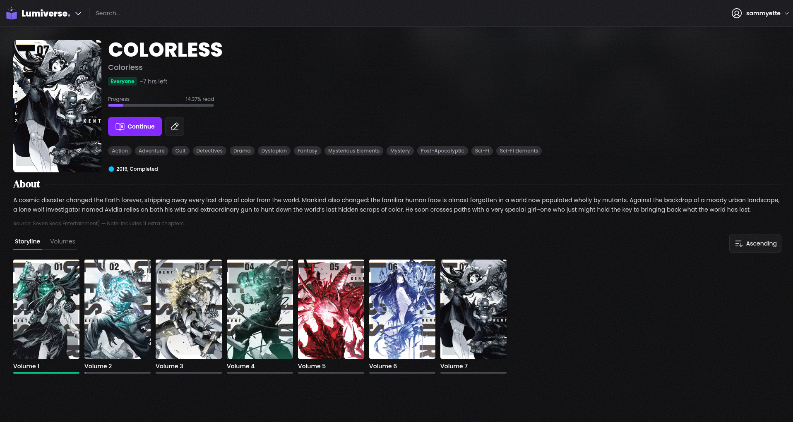

# Lumiverse

> A frontend for Kavita.

Lumiverse is a self-hosted Kavita frontend that runs faster, looks beautiful, and delivers images in an optimized way.






## Install

### Docker

```sh
docker run -d \
  --name lumiverse \
  -p 8000:8000 \
  -e KAVITA_URL=http://kavita:5000 \
  -e KAVITA_API_KEY=your-kavita-api-key \
  -v "/data:/app/data" \
  ghcr.io/sammy-ette/lumiverse:main
```

### Source

Note that libvips is required.

```sh
git clone https://github.com/sammy-ette/Lumiverse
cd Lumiverse
bun install
gleam deps download
gleam run -m lustre/dev build
go build -o lumiverse .
KAVITA_URL=http://localhost:5000 ./lumiverse
```

## Configuration

Variable | Default | Description
--- | --- | ---
`KAVITA_URL` | - | The Kavita URL not behind reverse proxy (internal URL).
`KAVITA_API_KEY` | - | Used for server-side Kavita requests, scrobbling and routes which require admin.
`PORT` | `8000` | HTTP port.
`DB_PATH` | `lumiverse.db` | SQLite database path.
